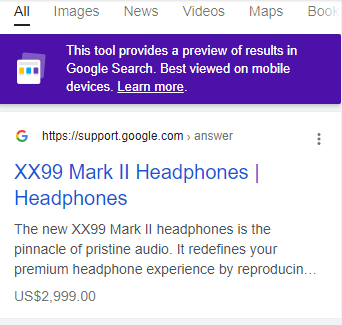

# Audiophile eCommerce Web Application

Audiophile is a online store that sells luxury and branded audio gadgets ranging from earphones, speakers, to headsets. The main aim of this web application is to present the products in the most user-friendly format and keeping accessibility in mind. 


## Tech Stack

**Frontend Stack:** React, Next JS, & TypeScript

**React Libraries:** Styled Components, Redux,  Redux Toolkit, React HookForm, Yup Validation, React Toastify, & Axios 

**Deployment:** Heroku, Netlify, & Vercel 

**Tools:** Google Rich Results Test, Schema Generator, PhotoShop, Canva, Lighthouse, GT Metrix, FireFox Developer Tools, Trello, Git, Redux DevTools, WAVE Accessibility Tool, & VS Code Editor  


## Run Locally

Run this application into your local environment by forking the repository and enter the following commands in your local terminal

Clone the project

```bash
  git clone https://github.com/folathecoder/audiophile.git
```

Go to the project directory

```bash
  cd audiophile
```

Install dependencies

```bash
  npm install
```

Start the server

```bash
  npm run dev
```


## Screenshot


## SEO 

Schema markup were dynamically rendered on all product pages using a function that takes in the product data as an argument and returns a customized JSON-LD. 

```bash
  helpers/schemaGenerator.ts
```

```bash
  export const productSchemaGenerator = (product): object => {
  const productName = convertToUpperCase(product.name);

  return {
    "@context": "https://schema.org/",
    "@type": "Product",
    name: `${productName}`,
    image: `https://audiophilic.vercel.app/${product.image.desktop}`,
    description: `${product.description}`,
    brand: "Audiophile",
    sku: `${product.id}`,
    offers: {
      "@type": "Offer",
      url: `https://audiophilic.vercel.app/product/${product.slug}`,
      priceCurrency: "USD",
      price: `${product.price}`,
      priceValidUntil: "2023-08-02",
      availability: "https://schema.org/InStock",
      itemCondition: "https://schema.org/NewCondition",
    },
  };
};
```

This function is called before products are pre-rendered at build time.


**Results of Schema markup implementation**




## Lessons Learned

This project is one of [frontendmentor.io](https://frontendmentor.io)'s GURU challenges. I have been taking up challenges on their platform for almost a year, since I started my coding journey, and I remember looking at this particular project, wondering when I will be skilled enough to execute it. Well! Now I know! 😎

This project is by far one of the hardest projects I have ever executed. It was both challenging and full of learning/unlearning of new TypeScript, React & Next JS concepts. 


## 🔗 Social Links

[](https://folarin.dev/)

[](https://linkedin.com/in/akinloye-folarin)

[](https://twitter.com/folathecoder)


## Authors

- **Coded By:** [@folathecoder](https://www.github.com/folathecoder)
- **Designed By:** [@frontendmentor.io](https://frontendmentor.io)

